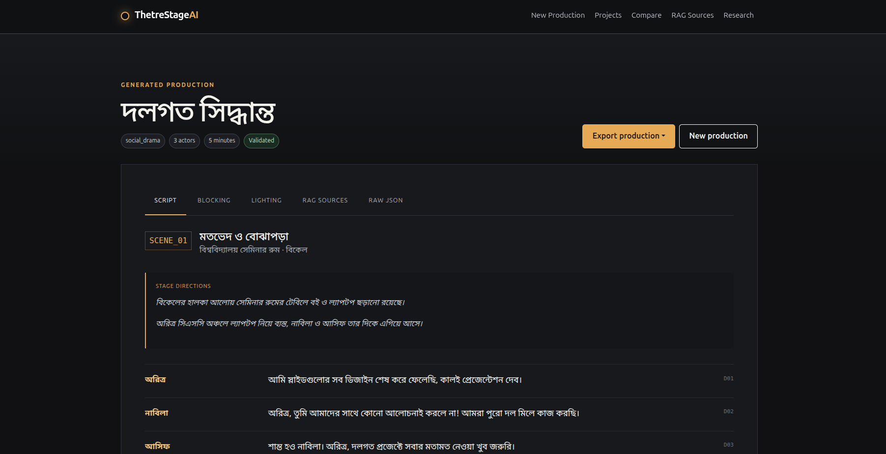
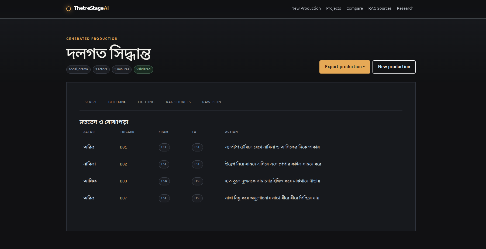
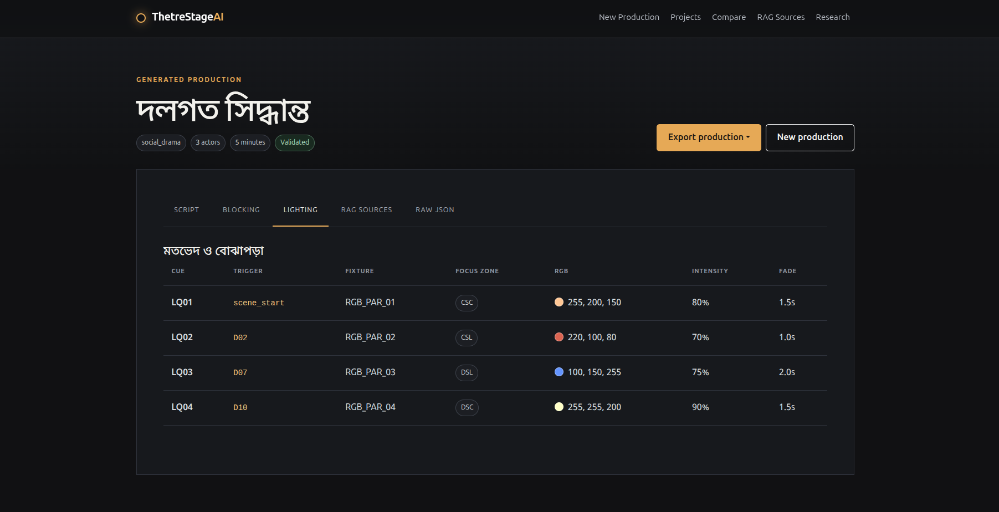
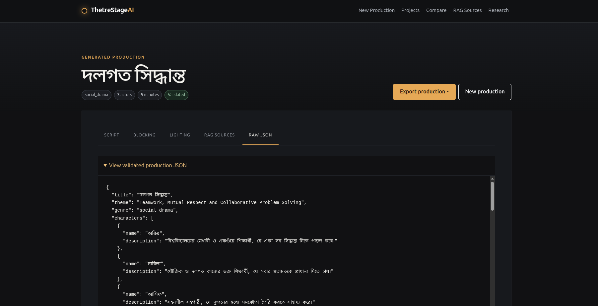

# ThetreStageAI

ThetreStageAI is a research prototype for Bengali theatre-production intelligence. The planned system will use retrieval-augmented generation (RAG) to produce Bengali scenes, dialogue, actor blocking, stage directions, lighting directions, and structured lighting cues.

This repository currently contains only the project architecture and local-development configuration. Dataset ingestion, indexing, retrieval, generation, and evaluation behavior are intentionally not implemented in this phase.

## Prerequisites

- Python 3.11 or newer
- A Gemini API key from Google AI Studio for the default provider, or local Ollama

## Local setup

Create and activate a virtual environment:

```bash
python3 -m venv .venv
source .venv/bin/activate
```

On Windows PowerShell, activate it with:

```powershell
py -3.11 -m venv .venv
.venv\Scripts\Activate.ps1
```

Install dependencies and configure the environment:

```bash
python -m pip install --upgrade pip
python -m pip install -r requirements.txt
cp .env.example .env
```

Then validate and start the project:

```bash
python manage.py check
python manage.py migrate
python manage.py runserver
```

## Architecture

- `thetrestageai/` contains project-wide Django configuration, routing, and ASGI/WSGI entry points.
- `theatre/` is the application boundary for theatre workflows, persistence, forms, HTTP views, and API routing.
- `theatre/services/` keeps domain operations out of Django views. Its subpackages isolate data preparation, RAG orchestration, retrieval, local LLM access, and output validation.
- `theatre/templates/` contains server-rendered Django templates; `static/` holds project-wide CSS, JavaScript, and images.
- `data/raw/` is reserved for immutable source material; `data/processed/` for normalized artifacts; and `data/retrieval_views/` for retrieval-oriented representations. Generated contents are ignored by Git.
- `storage/qdrant/` is the environment-configured persistence directory for Qdrant local mode. Its generated contents are ignored by Git.
- `evaluation/` will hold offline RAG and generation evaluation code and fixtures.
- `scripts/` will hold explicit research and maintenance entry points, separate from web requests.
- `tests/` is reserved for cross-application and integration tests; application-specific tests live under `theatre/tests/`.

## Configuration

Settings are read from `.env` and exposed through Django settings. Relative data and storage paths are resolved from `BASE_DIR`; callers should not hard-code filesystem locations. Never commit `.env`, local databases, model caches, source datasets, or Qdrant storage.

Ollama and embedding clients will be initialized lazily in later phases. Starting Django does not download an embedding model or contact Ollama.

## Inspecting the dataset

Set `THEATRE_DATASET_PATH` in `.env` to the directory containing
`bangla_natok_500.jsonl` and `retrieval_views/`, then run:

```bash
python manage.py inspect_theatre_dataset
```

An explicit read-only location can also be supplied without changing configuration:

```bash
python manage.py inspect_theatre_dataset --dataset-path /path/to/dataset
```

The command validates the three canonical retrieval-view files individually. It does
not load `all_retrieval_views.jsonl`, which would duplicate those records, and it
never writes to the dataset.

## Building the multi-view RAG index

With the full requirements installed, build the three persistent local Qdrant
collections with:

```bash
python manage.py build_rag_index
```

To explicitly delete and recreate only `thetrestageai_scene`,
`thetrestageai_blocking`, and `thetrestageai_lighting` before indexing:

```bash
python manage.py build_rag_index --rebuild
```

The command embeds only each document's `search_text` using normalized BAAI/bge-m3
vectors and cosine similarity. It preserves the complete retrieval document in the
Qdrant point payload. The embedding and upsert batch sizes can be tuned through
`EMBEDDING_BATCH_SIZE` and `QDRANT_UPSERT_BATCH_SIZE`.

## Testing multi-view retrieval

After building the index, run one Bengali request through three independently
constructed semantic queries:

```bash
python manage.py test_retrieval "দুইজন চরিত্রের রাগপূর্ণ পারিবারিক সংঘাত"
```

Scene retrieval returns five results, while blocking and lighting retrieval each
return three. Application code may also pass exact-match metadata filters such as
`theme`, `genre`, `scene_type`, `location`, `time`, `actors_count`, or `emotion` to
an individual retriever.

The `ContextBuilder` combines those result sets into size-bounded, clearly separated
reference sections and returns an IEEE-evaluation-friendly retrieval trace. Duplicate
sources are removed within each view, irrelevant metadata is excluded, and explicit
production rules prohibit copying retrieved dialogue verbatim. Context construction
does not call Ollama or any other language model.

## Gemini setup (default provider)

Install the project dependencies, including the official `google-genai` SDK:

```bash
python -m pip install -r requirements.txt
```

Create a Gemini API key in [Google AI Studio](https://aistudio.google.com/app/apikey),
then store it only in the ignored local `.env` file:

```env
THETRESTAGEAI_LLM_PROVIDER=gemini
GEMINI_API_KEY=YOUR_KEY
GEMINI_MODEL=gemini-3.6-flash
GEMINI_TIMEOUT_SECONDS=180
GEMINI_MAX_OUTPUT_TOKENS=8192
```

Test the configured provider and run Django:

```bash
python manage.py test_llm
python manage.py migrate
python manage.py runserver
```

Gemini receives the request-specific production JSON Schema using structured output
with `application/json`. No Search, Maps, grounding, or external tools are enabled.
Gemini free-tier availability and quotas are controlled by Google, are rate-limited,
and are not guaranteed or unlimited.

## Optional local Ollama and Qwen setup

No paid API is required. On Linux, install Ollama using its official installer:

```bash
curl -fsSL https://ollama.com/install.sh | sh
```

Start the local server if it is not already running as a service:

```bash
ollama serve
```

In another terminal, download the configured Qwen model:

```bash
ollama pull qwen3:4b
ollama list
```

Switch providers in `.env`:

```env
THETRESTAGEAI_LLM_PROVIDER=ollama
THETRESTAGEAI_OLLAMA_URL=http://localhost:11434
THETRESTAGEAI_LLM_MODEL=qwen3:4b
THETRESTAGEAI_LLM_TIMEOUT_SECONDS=900
THETRESTAGEAI_LLM_NUM_PREDICT=3072
```

The local client uses Ollama's non-streaming structured-output endpoint. It passes
the Pydantic JSON schema to Ollama and validates the returned JSON again locally.
Connection failures, timeouts, unavailable models, malformed API envelopes, Markdown
wrappers, invalid stage zones, and invalid cue values are rejected explicitly.

Generated JSON passes through a second strict validation boundary before it can be
used by any application or future hardware-control layer. Cross-record checks enforce
unique dialogue and lighting IDs, known speakers and actors, and cue triggers that
reference `scene_start`, `scene_end`, or a dialogue ID in the same scene. If initial
validation fails, exactly one schema-constrained correction is requested from the
configured local model. A second failure raises a controlled `ProductionValidationError`
containing both sets of validation issues; no partially valid lighting data is returned.

For macOS and Windows installers, use the official Ollama download page:
<https://ollama.com/download>.

## End-to-end web generation

After migrating the database and building the RAG index, the New Production form
runs the complete provider-independent pipeline. For Gemini:

```bash
python manage.py migrate
python manage.py build_rag_index
python manage.py test_llm
python manage.py runserver
```

When Ollama is selected, start `ollama serve` and pull `qwen3:4b` first.

The Django view delegates orchestration to `theatre.services.production_service`.
Every accepted brief creates a project, successful runs store validated JSON and
retrieval evidence, and failed runs retain controlled diagnostic evidence without
exposing stack traces or unsafe lighting data to the UI.

## Generated production example

The following validated example demonstrates how one structured production brief is
transformed into Bengali dialogue, stage directions, actor blocking, and executable
lighting cues.

### Production brief

```text
Story Idea:
দুই বিশ্ববিদ্যালয় শিক্ষার্থী একটি গ্রুপ প্রজেক্টে কাজ করতে গিয়ে মতবিরোধে জড়িয়ে পড়ে। একজন সব সিদ্ধান্ত একাই নিতে চায়, অন্যজন মনে করে দলের সবার মতামত সমান গুরুত্ব পাওয়া উচিত। তর্কের পর তারা নিজেদের ভুল বুঝতে পারে এবং পারস্পরিক সম্মান ও দলগত সহযোগিতার মাধ্যমে প্রজেক্টটি সম্পন্ন করার সিদ্ধান্ত নেয়।

Theme: Teamwork, Mutual Respect and Collaborative Problem Solving
Genre: social_drama
Language: bn
Number of Actors: 3
Duration (minutes): 5
Stage Size: small
Available Lights: RGB_PAR_01, RGB_PAR_02, RGB_PAR_03, RGB_PAR_04
Scene Time: বিকেল
Desired Emotion: বিরক্তি, দ্বিধা, উত্তেজনা, উপলব্ধি, সহযোগিতা
```

### Application output

#### Script and stage directions



#### Actor blocking



#### Structured lighting cues



#### Validated raw JSON



<details>
<summary>View the complete validated JSON output</summary>

```json
{
  "title": "দলগত সিদ্ধান্ত",
  "theme": "Teamwork, Mutual Respect and Collaborative Problem Solving",
  "genre": "social_drama",
  "characters": [
    {
      "name": "অরিত্র",
      "description": "বিশ্ববিদ্যালয়ের মেধাবী ও একগুঁয়ে শিক্ষার্থী, যে একা সব সিদ্ধান্ত নিতে পছন্দ করে।"
    },
    {
      "name": "নাবিলা",
      "description": "যৌক্তিক ও দলগত কাজের ভক্ত শিক্ষার্থী, যে সবার মতামতকে প্রাধান্য দিতে চায়।"
    },
    {
      "name": "আসিফ",
      "description": "সহনশীল সহপাঠী, যে দুজনের মধ্যে সমঝোতা তৈরি করতে সাহায্য করে।"
    }
  ],
  "scenes": [
    {
      "id": "SCENE_01",
      "title": "মতভেদ ও বোঝাপড়া",
      "location": "বিশ্ববিদ্যালয় সেমিনার রুম",
      "time": "বিকেল",
      "dialogue": [
        {"id": "D01", "speaker": "অরিত্র", "text": "আমি স্লাইডগুলোর সব ডিজাইন শেষ করে ফেলেছি, কালই প্রেজেন্টেশন দেব।"},
        {"id": "D02", "speaker": "নাবিলা", "text": "অরিত্র, তুমি আমাদের সাথে কোনো আলোচনাই করলে না! আমরা পুরো দল মিলে কাজ করছি।"},
        {"id": "D03", "speaker": "আসিফ", "text": "শান্ত হও নাবিলা। অরিত্র, দলগত প্রজেক্টে সবার মতামত নেওয়া খুব জরুরি।"},
        {"id": "D04", "speaker": "অরিত্র", "text": "সময় খুব কম ছিল। সবাই মিলে সিদ্ধান্ত নিতে গেলে অনেক দেরি হয়ে যেত।"},
        {"id": "D05", "speaker": "নাবিলা", "text": "কিন্তু প্রজেক্টের দ্বিতীয় অংশে গবেষণার মূল উপাত্তগুলো বাদ পড়ে গেছে, যা আসিফ তৈরি করেছিল।"},
        {"id": "D06", "speaker": "আসিফ", "text": "আমার মনে হয় একা একা সব দায়িত্ব না নিয়ে কাজগুলো ভাগ করে নেওয়া উচিত ছিল।"},
        {"id": "D07", "speaker": "অরিত্র", "text": "আমি বুঝতে পারছি, তাড়াহুড়ো করতে গিয়ে আমি ভুল সিদ্ধান্ত নিয়ে ফেলেছি।"},
        {"id": "D08", "speaker": "নাবিলা", "text": "নিজের ভুল স্বীকার করার জন্য ধন্যবাদ। আমরা সবাই এখন একসঙ্গে বসে ফাইলটি ঠিক করি।"},
        {"id": "D09", "speaker": "আসিফ", "text": "হ্যাঁ, চলো সবাই মিলে বিকেলের মধ্যেই প্রেজেন্টেশনটি গুছিয়ে ফেলি।"},
        {"id": "D10", "speaker": "অরিত্র", "text": "ধন্যবাদ বন্ধুদের, দলগত প্রচেষ্টাই যে সেরা সমাধান তা আমি এবার উপলব্ধি করলাম।"}
      ],
      "stage_directions": [
        "বিকেলের হালকা আলোয় সেমিনার রুমের টেবিলে বই ও ল্যাপটপ ছড়ানো রয়েছে।",
        "অরিত্র সিএসসি অঞ্চলে ল্যাপটপ নিয়ে ব্যস্ত, নাবিলা ও আসিফ তার দিকে এগিয়ে আসে।"
      ],
      "blocking": [
        {"actor": "অরিত্র", "from": "USC", "to": "CSC", "action": "ল্যাপটপ টেবিলে রেখে নাবিলা ও আসিফের দিকে তাকায়", "trigger": "D01"},
        {"actor": "নাবিলা", "from": "CSL", "to": "CSC", "action": "উদ্বেগ নিয়ে সামনে এগিয়ে এসে পেপার ফাইল সামনে ধরে", "trigger": "D02"},
        {"actor": "আসিফ", "from": "CSR", "to": "DSC", "action": "হাত তুলে দুজনকে থামানোর ইঙ্গিত করে মাঝখানে দাঁড়ায়", "trigger": "D03"},
        {"actor": "অরিত্র", "from": "CSC", "to": "DSL", "action": "মাথা নিচু করে অনুশোচনার সাথে ধীরে ধীরে পিছিয়ে যায়", "trigger": "D07"}
      ],
      "lighting": [
        {"cue_id": "LQ01", "trigger": "scene_start", "fixture": "RGB_PAR_01", "focus_zone": "CSC", "rgb": [255, 200, 150], "intensity": 80, "fade_seconds": 1.5},
        {"cue_id": "LQ02", "trigger": "D02", "fixture": "RGB_PAR_02", "focus_zone": "CSL", "rgb": [220, 100, 80], "intensity": 70, "fade_seconds": 1.0},
        {"cue_id": "LQ03", "trigger": "D07", "fixture": "RGB_PAR_03", "focus_zone": "DSL", "rgb": [100, 150, 255], "intensity": 75, "fade_seconds": 2.0},
        {"cue_id": "LQ04", "trigger": "D10", "fixture": "RGB_PAR_04", "focus_zone": "DSC", "rgb": [255, 255, 200], "intensity": 90, "fade_seconds": 1.5}
      ],
      "sound": []
    }
  ]
}
```

</details>

### Additional validated example

### Input

```text
Story idea:
দুই বিশ্ববিদ্যালয় শিক্ষার্থী একটি ভুয়া অনলাইন পোস্ট নিয়ে দ্বন্দ্বে জড়িয়ে পড়ে।
শেষে তারা তথ্য যাচাইয়ের গুরুত্ব বুঝতে পারে।

Theme: Fake News and Responsible Social Media Use
Genre: social_drama
Language: bn
Number of actors: 2
Target duration: 1 minute
Stage size: small
Available lighting fixtures: RGB_PAR_01, RGB_PAR_02, RGB_PAR_03, RGB_PAR_04
Scene time: সন্ধ্যা
Desired emotion: রাগ, দ্বিধা, উপলব্ধি
```

### Validated structured output

```json
{
  "title": "গুজবের ছায়া",
  "theme": "Fake News and Responsible Social Media Use",
  "genre": "social_drama",
  "characters": [
    {
      "name": "আকাশ",
      "description": "বিশ্ববিদ্যালয়ের সাংবাদিকতা বিভাগের দ্বিতীয় বর্ষের সচেতন ছাত্র, যে সত্য ও তথ্যের সঠিকতায় বিশ্বাসী।"
    },
    {
      "name": "সোহান",
      "description": "কম্পিউটার সায়েন্স বিভাগের আবেগপ্রবণ ছাত্র, যে তথ্য যাচাই না করে দ্রুত সোশ্যাল মিডিয়ায় খবর ছড়িয়ে দেয়।"
    }
  ],
  "scenes": [
    {
      "id": "SCENE_01",
      "title": "ভুল তথ্যের মাশুল",
      "location": "বিশ্ববিদ্যালয় ক্যাফেটেরিয়ার কোণ",
      "time": "সন্ধ্যা",
      "dialogue": [
        {
          "id": "D01",
          "speaker": "আকাশ",
          "text": "সোহান, তুমি ফেসবুকে বিশ্ববিদ্যালয়ের স্কলারশিপ বাতিলের এই ভুয়া বিজ্ঞপ্তিটা শেয়ার করলে কেন?"
        },
        {
          "id": "D02",
          "speaker": "সোহান",
          "text": "কেন, একটা পরিচিত পেজে পেলাম আর শেয়ার দিলাম! এতে এত রাগান্বিত হওয়ার কী আছে?"
        },
        {
          "id": "D03",
          "speaker": "আকাশ",
          "text": "কী আছে মানে? হাজার হাজার সাধারণ শিক্ষার্থী এখন দুশ্চিন্তায় ভেঙে পড়ছে! তুমি কি খবরটার সত্যতা যাচাই করেছিলে?"
        },
        {
          "id": "D04",
          "speaker": "সোহান",
          "text": "আমি তো ভেবেছিলাম পেজটি অফিশিয়াল। সবাই শেয়ার করছিল, তাই আমিও আবেগবশত ক্লিক করে ফেলেছি।"
        },
        {
          "id": "D05",
          "speaker": "আকাশ",
          "text": "সবাই শেয়ার করলেই সেটা সত্য হয়ে যায় না! শেয়ার করার আগে মূল ওয়েবসাইট বা নোটিশ বোর্ডে চোখ বুলানো কি খুব কঠিন ছিল?"
        },
        {
          "id": "D06",
          "speaker": "সোহান",
          "text": "আমার ভুল হয়ে গেছে... সত্যি বলতে আমি বুঝতে পারিনি একটা শেয়ার এভাবে গুজব ছড়িয়ে দিতে পারে।"
        },
        {
          "id": "D07",
          "speaker": "আকাশ",
          "text": "সামাজিক যোগাযোগমাধ্যমে আমাদের প্রতিটি ক্লিকের একটা দায়িত্ব থাকে। এখন আর দ্বিধা না করে পোস্টটা মুছে একটা ভুল স্বীকারের ব্যাখ্যা দাও।"
        },
        {
          "id": "D08",
          "speaker": "সোহান",
          "text": "তুমি ঠিক বলেছ। আমি এখনই ভুয়া পোস্টটা ডিলিট করে সত্যিটা জানিয়ে দিচ্ছি। ভবিষ্যতে তথ্য যাচাই না করে আর কিছু ছড়াব না।"
        }
      ],
      "stage_directions": [
        "আকাশ হাতে মোবাইল নিয়ে ক্ষুব্ধ ভঙ্গিতে CSL থেকে দ্রুত হেঁটে CSC-তে এসে দাঁড়ায়।",
        "সোহান অপরাধীর মতো মুখ নিচু করে USR অঞ্চল থেকে ধীরে ধীরে CSC-তে আকাশের কাছে আসে।"
      ],
      "blocking": [
        {
          "actor": "আকাশ",
          "from": "CSL",
          "to": "CSC",
          "action": "উত্তেজিত হয়ে মোবাইলের স্ক্রিন দেখিয়ে সোহানের সামনে আসা",
          "trigger": "D01"
        },
        {
          "actor": "সোহান",
          "from": "USR",
          "to": "CSC",
          "action": "অনুতপ্ত হয়ে মাথা নিচু করে এগিয়ে আসা",
          "trigger": "D06"
        }
      ],
      "lighting": [
        {
          "cue_id": "LQ01",
          "trigger": "scene_start",
          "fixture": "RGB_PAR_01",
          "focus_zone": "CSL",
          "rgb": [220, 60, 40],
          "intensity": 70,
          "fade_seconds": 2.0
        },
        {
          "cue_id": "LQ02",
          "trigger": "D06",
          "fixture": "RGB_PAR_02",
          "focus_zone": "CSC",
          "rgb": [240, 190, 90],
          "intensity": 85,
          "fade_seconds": 1.5
        }
      ],
      "sound": []
    }
  ]
}
```

## Research evaluation

### Dataset EDA notebook

The exploratory dataset analysis is available at
[`Notebooks/ThetreStageAI_Dataset_EDA.ipynb`](Notebooks/ThetreStageAI_Dataset_EDA.ipynb).
Install its optional dependencies separately so the web-application dependency set
remains focused:

```bash
python -m pip install -r requirements-notebook.txt
python -m ipykernel install --user --name thetrestageai --display-name "ThetreStageAI (.venv)"
jupyter lab
```

Select the **ThetreStageAI (.venv)** kernel, open the notebook, and choose **Restart
Kernel and Run All Cells**. The notebook locates the dataset whether Jupyter starts
from the repository root or from `Notebooks/`, and writes figures and tables under
`eda_outputs/` relative to the notebook working directory.

The `evaluation` package defines the four comparison conditions, ranked retrieval
metrics, objective generation measurements, append-only JSONL experiment storage,
and CSV exports. Concrete system adapters must execute the real A/B/C/D pipelines
and return `SystemRunOutput`; the runner never invents results or expert judgments.

Use `export_expert_evaluation_csv(records, path)` to create the theatre-expert review
sheet. All quality ratings and comments are deliberately blank until completed by
human evaluators. `export_experiment_csv(records, path)` exports the objective run
metadata separately.

### RAG ablation modes

The research inspector at `/research/rag/` supports six reproducible modes: no
RAG, scene-only, scene plus blocking, scene plus lighting, single combined
retrieval, and full scene/blocking/lighting multi-view retrieval. Every
`GenerationRun` stores its `rag_mode`, source evidence, scores, and Top-K settings.
The combined baseline sends one unexpanded query through the existing collections,
globally ranks the candidates by similarity, and retains the configured combined
Top-K.

### Reproducibility logging

Every pipeline-created `GenerationRun` emits one structured
`theatre.research.experiments` log event after database persistence. The event
contains the run timestamp, model and allowlisted generation settings, RAG mode,
credential-redacted user input, effective per-retriever Top-K, source IDs and
similarity scores, duration, validation status, repair count, and safe error fields.
Raw model output, retrieved payloads, server URLs, credentials, and environment
variables are never included. Configure verbosity with
`THETRESTAGEAI_EXPERIMENT_LOG_LEVEL`.
